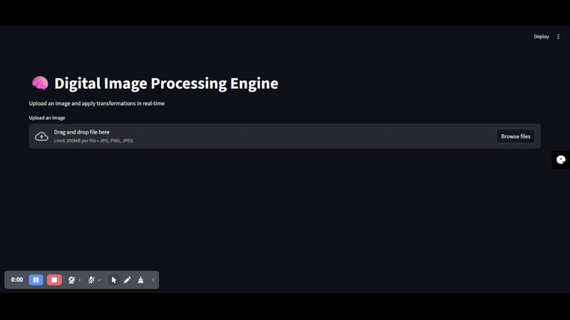

# 🧠 Digital Image Processing Engine

<p align="center">
  
  
  
  
</p>

> A powerful, real-time digital image processing engine built with Streamlit and NumPy. Apply stunning visual transformations instantly!

---

## 🎥 Demo Video

Watch the Image Processing Engine in action:



> **Note:** If the video doesn't play above, download it or view it in the `assets` folder of the repository.

---

## ✨ Features

| Feature | Description |
|---------|-------------|
| 🖼️ **Image Upload** | Support for JPG, PNG, JPEG formats |
| 🔲 **Grayscale** | Convert images to professional grayscale |
| ☀️ **Brightness Control** | Adjust brightness from 0.5x to 2.0x |
| 🔄 **Color Inversion** | Create stunning inverted color effects |
| ✂️ **Image Cropping** | Interactive crop with precise coordinate controls |

---

## 🚀 Quick Start

### Prerequisites

- Python 3.8+
- pip

### Installation

```bash
# Clone the repository
git clone https://github.com/aditya149s/Digital-Image-Processing-Engine.git
cd Image-Processing-Engine

# Install dependencies
pip install -r requirements.txt
```

### Run the Application

```bash
streamlit run app.py
```

The app will open in your default browser at `http://localhost:8501`

---

## 🛠️ Tech Stack

<div align="center">

| Technology | Purpose |
|------------|---------|
|  | Web Framework |
|  | Core Language |
|  | Image Array Processing |
|  | Image Manipulation (PIL) |

</div>

---

## 📁 Project Structure

```
Image-Processing-Engine/
├── app.py                              # Main Streamlit application
├── digital_image_processing_engine.py  # Core processing logic (Colab)
├── Image-Processing-Engine.mp4         # Demo video
├── requirements.txt                    # Python dependencies
└── README.md                           # Project documentation
```

---

## 🎯 Usage Guide

### 1. Upload an Image
Click the file uploader and select any JPG, PNG, or JPEG image.

### 2. Adjust Controls
Use the sidebar sliders to fine-tune your transformations:
- **Brightness**: Drag between 0.5x (darker) and 2.0x (brighter)
- **Crop Coordinates**: Set X1, Y1, X2, Y2 to define your crop region

### 3. View Results
Switch between tabs to see different processing outputs:
- Grayscale conversion
- Brightness-adjusted image
- Color-inverted image
- Cropped image

---

## 💡 How It Works

### Grayscale Conversion
```python
grayscale_img = img.convert('L')
```

### Brightness Enhancement
```python
enhancer = ImageEnhance.Brightness(img)
bright_img = enhancer.enhance(brightness_value)
```

### Color Inversion
```python
invert_img = ImageChops.invert(img.convert("RGB"))
```

### Image Cropping
```python
img_array = np.array(img.convert("RGB"))
cropped_array = img_array[y1:y2, x1:x2]
cropped_img = Image.fromarray(cropped_array)
```

---

## 📊 Processing Pipeline

```
┌─────────────┐    ┌──────────────┐    ┌─────────────────┐
│  Image      │───▶│  NumPy/PIL   │───▶│  Streamlit UI    │
│  Upload     │    │  Processing  │    │  Visualization   │
└─────────────┘    └──────────────┘    └─────────────────┘
                           │
           ┌───────────────┼───────────────┐
           ▼               ▼               ▼
    ┌────────────┐  ┌────────────┐  ┌────────────┐
    │ Grayscale  │  │ Brightness │  │   Invert   │
    └────────────┘  └────────────┘  └────────────┘
```

---

## 🤝 Contributing

Contributions are welcome! Please feel free to submit a Pull Request.

1. Fork the repository
2. Create your feature branch (`git checkout -b feature/AmazingFeature`)
3. Commit your changes (`git commit -m 'Add some AmazingFeature'`)
4. Push to the branch (`git push origin feature/AmazingFeature`)
5. Open a Pull Request

---

## 📝 License

This project is licensed under the MIT License - see the [LICENSE](LICENSE) file for details.

---

## 👤 Author

**Your Name**
- GitHub: [@yourusername](https://github.com/aditya149s)
- LinkedIn: [Your LinkedIn](https://linkedin.com/in/aditya-sharma-01ab2137a)

---

<p align="center">
  Made with ❤️ using Streamlit & NumPy
</p>
